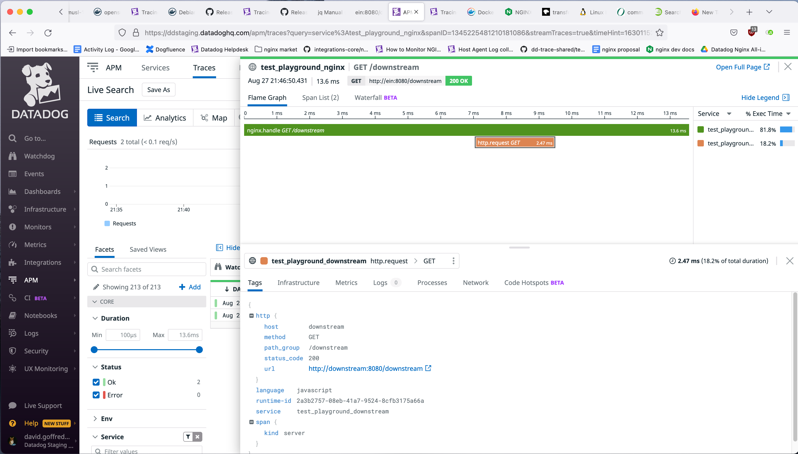

Datadog Nginx Tracing Playground
================================

Why
---
I want to verify that nginx can be installed, operated, and traced using
Datadog on a variety of Linux distributions.

What
----
This is a `docker-compose` setup that installs and runs the most recent open
source release of nginx on a specified base image, and then stands up the
Datadog agent and a downstream web server.

Query `http://localhost:8080` and `http://localhost:8080/downstream` from the
host machine, and then search the Datadog UI for traces having
`service:test_playground_nginx`.

How
---
```console
$ bin/run --help
nginx tracing playground

usage:
    DD_API_KEY=KEY bin/run IMAGE
        Install nginx on the specified Docker base IMAGE, and bring up nginx along with
        the Datadog agent and a downstream web server, all accessible on port
        8080 of the host.  Use the specified KEY to authenticate the Datadog agent.

    bin/run --help
    bin/run -h
        Print this message.

$ DD_API_KEY=<REDACTED> bin/run ubuntu:18.04 &
... lots of output ...

$ curl http://localhost:8080/downstream
You hit the node script, congrats. Here are your headers:

{
  "x-datadog-trace-id": "3536317360567308007",
  "x-datadog-parent-id": "3536317360567308007",
  "x-datadog-sampling-priority": "1",
  "host": "downstream:8080",
  "connection": "close",
  "user-agent": "curl/7.74.0",
  "accept": "*/*"
}

$ kill %1
```
Then a Datadog search for traces using the `service:test_playground_nginx`
filter shows something like:



More
----
### Dependencies
- docker-compose
- docker

### Known to Work
The following base images have been tested using this docker-compose setup and
are known to work:
- `centos:8`
- `ubuntu:18.04`
- `debian:buster`
- `opensuse/leap:15.2`

### Known to Fail
The following base image has been tested using this docker-compose setup and is
known _not_ to work:
- `alpine:3`
